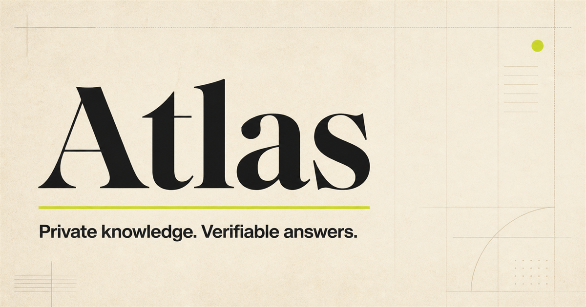
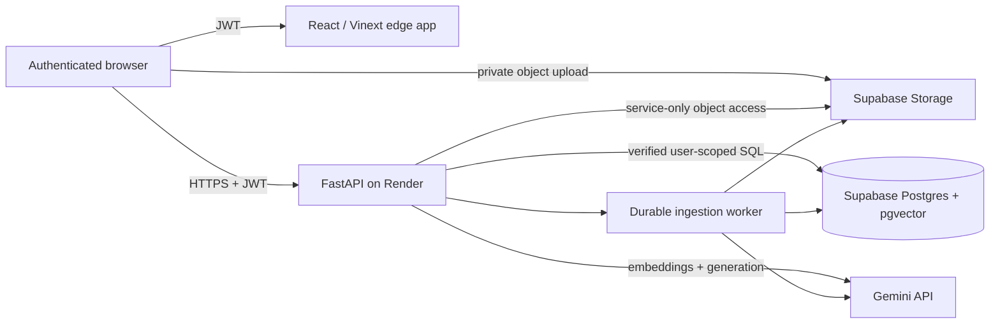

# Atlas — private, cited RAG



Atlas is a complete authenticated retrieval-augmented generation application built as a portfolio-grade product, not a chat mockup. Each user owns a private document library and saved conversation history. Answers stream from Gemini, are constrained to retrieved evidence, and link back to validated source chunks.

The engineering is production-oriented; the infrastructure is intentionally hobby-tier and can run for free. Free Render and Supabase projects may sleep or pause, so this repository does not claim an uptime SLA.

## What is implemented

- Email registration, verification, login, password recovery, session restoration, and optional Cloudflare Turnstile protection.
- Private direct-to-Supabase uploads for text PDFs, DOCX, TXT, Markdown, and HTML.
- Durable database-backed ingestion with leases, restart recovery, bounded retries, progress, re-indexing, and atomic publication.
- Structure-aware parsing/chunking, scanned-PDF rejection, quotas, MIME checks, stable locations, and batched embeddings.
- User-scoped pgvector and PostgreSQL full-text retrieval fused with reciprocal-rank fusion.
- Evidence-only generation, insufficient-evidence refusal, prompt-injection isolation, and server-validated citations.
- Persistent conversations, streaming responses, rolling summaries, feedback, source links, and complete account deletion.
- PostgreSQL row-level security, private Storage policies, verified JWT identity, request IDs, safe logs, CSP/security headers, and per-user limits.
- Unit, component, desktop/mobile browser, security, dependency-audit, and versioned RAG evaluation suites.
- Docker builds, local Supabase support, GitHub CI/security scanning, Render Blueprint, and Cloudflare deployment output.

## Architecture



Production requests use the hosted services above. Docker is only an alternative local environment; no production work is routed through the developer's computer.

For the detailed data flow and trust boundaries, see [architecture.md](docs/architecture.md).

## Repository map

```text
app/                 React application routes
components/          Auth, workspace, citations, uploads, Turnstile
lib/                 Supabase client, typed API and SSE client
backend/src/atlas/   FastAPI API, retrieval, ingestion, memory, providers
backend/tests/       Backend/security/schema tests
supabase/migrations/ Versioned PostgreSQL, pgvector, RLS, Storage policies
evaluation/          Licensed-in-repo fixture and versioned RAG dataset
docs/                Setup, deployment, security, privacy, operations, ADRs
.github/              CI, dependency updates, secret/container scanning
```

## Start and deploy

All credential and account steps are deliberately collected in [setup.md](docs/setup.md). Deployment is in [deployment.md](docs/deployment.md). The short local path is:

```bash
npm install --global npm@11.6.2
npm ci
cp .env.example .env.local
cd backend
python -m venv .venv
.venv/Scripts/python -m pip install -e ".[dev]"  # Windows
copy .env.example .env                            # Windows
```

Then run the backend with `uvicorn atlas.main:app --reload` and the frontend with `npm run dev`. Both need the Supabase and Gemini values described in the setup guide before authenticated RAG works.

## Verification commands

```bash
npm run lint
npm run typecheck
npm test
npm run test:e2e
npm run build

cd backend
python -m ruff check src tests
python -m mypy src tests
python -m pytest --cov=atlas
python -m pip_audit --local
```

The online RAG evaluator expects the included fixture to be uploaded to its evaluator account:

```bash
python -m atlas.evaluation \
  --dataset ../evaluation/dataset.v1.json \
  --base-url http://localhost:8000/api/v1 \
  --token YOUR_TEST_USER_ACCESS_TOKEN
```

## Deliberate tradeoffs

- FastAPI and the ingestion runner share one Render service because the free plan has no separate worker. The jobs table makes restarts recoverable.
- Cloudflare Workers with static assets is used for the Vinext server-rendered frontend. A Pages-only static export would remove the app-router runtime; this stays on Cloudflare's free edge tier.
- Gemini's free tier is suitable only for non-sensitive portfolio content. The UI states that provider processing may be used to improve products.
- OCR is not included. A scanned PDF is rejected clearly rather than indexed badly.
- In-memory rate limiting is per process. The single-instance free deployment makes that useful, but a scaled system should move limits to Redis or the edge.

## Documentation

- [Setup](docs/setup.md)
- [Deployment](docs/deployment.md)
- [Security model](docs/security.md)
- [Privacy and data lifecycle](docs/privacy.md)
- [Operational runbook](docs/runbook.md)
- [Acceptance checklist](docs/acceptance.md)
- [Implementation source of truth](IMPLEMENTATION_TRACKER.md)

## License

MIT. The small evaluation fixture is original project documentation and is covered by the same license.
